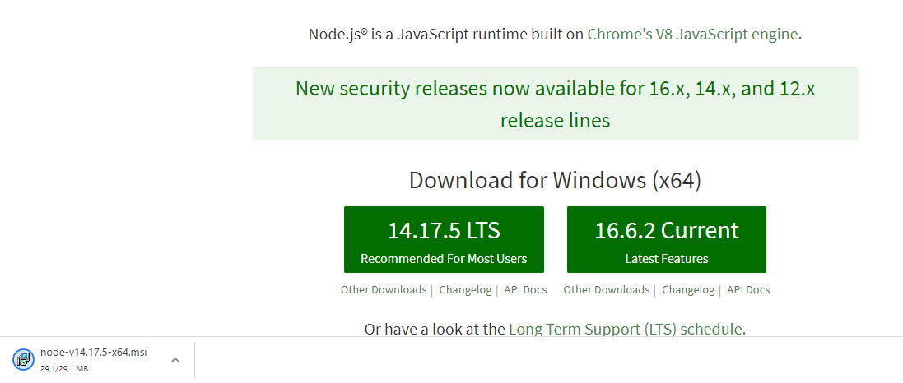
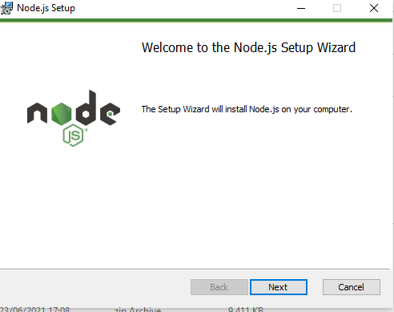
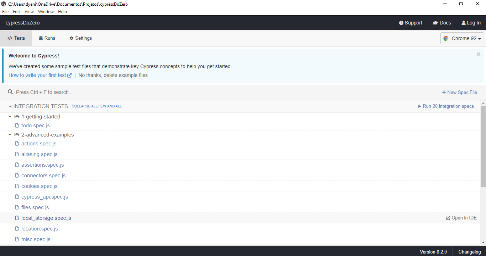

# cypressDoZero

**- Ambiente**

1. Node js, que vai interpretar os arquivos javascript e vai fazer toda a execução e também junto dele vem o NPM
   que vai fazer o gerenciamento dos pacotes.

`https://nodejs.org/en/`

Para instalar o o Node é só ir dando "Next"

2. Escolha uma IDE que interprete JavaScript, escolhi o VsCode

`https://code.visualstudio.com/`

3. Instalar o Cypress com o Cucumber
Navegue até a pasta do seu projeto e execute o seguinte comando:
   `npm install --save-dev cypress cypress-cucumber-preprocessor`
   
4. Ainda dentro do teu projeto, é necessário executar o comando `npx cypress open` para que assim o Cypress termina de criar os arquivos locais. Feito esse passo com sucesso, abrirá a seguinte página:

   